# Temporal SVD Hybrid Nitrogen Risk

This note explains the hybrid phenology model in plain linear-algebra terms. It shows how 5-step NDRE time series are decomposed with SVD, how residuals highlight stress, how we turn those signals into supervised and unsupervised detectors, and how we fuse them into one nitrogen-risk score.

## Data: 5-step NDRE time series
- Each field/tile has NDRE at 5 phenology windows (rows are fields, columns are time steps).
- Build a matrix $X \in \mathbb{R}^{N \times 5}$; row $x_i$ is the 5-step series for field $i$.
- Standardize each column so every time step is on the same scale:

  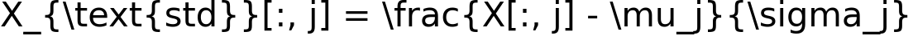

  where $\mu_j, \sigma_j$ are the mean and std of column $j$.

## 1) Temporal SVD: the low-rank phenology backbone
Think of SVD as finding the main “shapes” of healthy growth across time.
- Compute SVD on standardized data:

  

- Keep the smallest $k \le 5$ singular values that explain at least 95% of the variance:

  

- For each field $i$:
  - Phenology coordinates (PC scores): 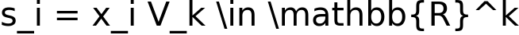
  - Expected low-rank trajectory: 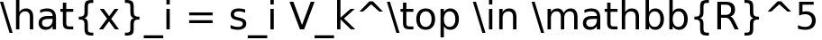
  - Residual (what does not fit the backbone): 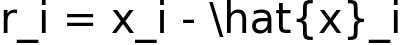
  - Residual size (SVD anomaly): 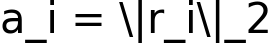

Interpretation:
- $V_k$ holds the dominant time patterns (e.g., normal rise and fall of NDRE).
- $s_i$ says where the field sits on those patterns.
- $r_i$ shows how the field deviates from expected growth; large $r_i$ can mean stress.

## 2) Supervised branch: CatBoost on SVD features
Goal: use labels (healthy vs deficient) to learn decision rules on the SVD signals.
- Labels $y_i \in \{0,1\}$: 1 = likely nitrogen deficient (derived from low NDRE minima).
- Features per field:

  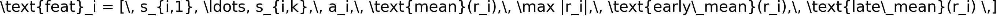

  - early_mean: average of the first time steps (t1-t2)
  - late_mean: average of the last time steps (t4-t5)

- Train a CatBoost classifier:

  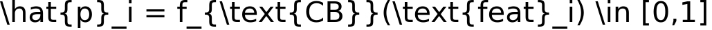

  where $\hat{p}_i$ is the probability of nitrogen deficiency.

## 3) Unsupervised branch: autoencoder on stacked channels
Goal: detect “unhealthy-looking” trajectories without labels by comparing to healthy patterns.
- Stack three channels for each field:

  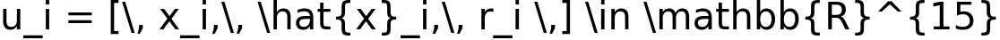

  (what happened, what SVD expects, and where they disagree).

- Train an autoencoder only on healthy fields ($y_i = 0$):

  

- AE anomaly score (how “unhealthy” the stacked channels look):

  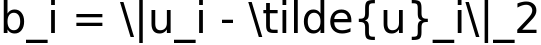

Interpretation:
- If a field’s stacked channels cannot be reconstructed well by a model trained on healthy fields, it likely deviates from normal phenology (stress, including nitrogen).

## 4) Fusion: one nitrogen risk score
Normalize the two unsupervised signals using train min-max:

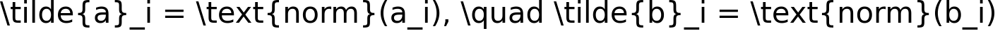

Blend supervised probability with unsupervised stress signals:

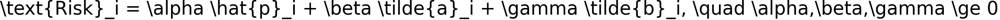

Defaults: 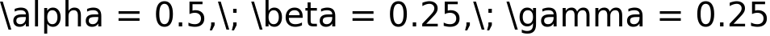.

Decision: mark field $i$ as nitrogen-deficient if $\text{Risk}_i > \tau$, with $\tau$ chosen from precision-recall/F1 on validation data.

## How this flags nitrogen issues
- Low-rank fit catches the expected growth curve; residuals capture “shape errors.”
- CatBoost learns label-driven rules on both the location on the phenology manifold (scores) and how the field deviates (residual summaries).
- The AE adds a label-free anomaly score that highlights fields whose stacked channels (actual, expected, residual) look unlike healthy examples.
- Fusion keeps the supervised signal in the lead while adding two independent stress checks, improving robustness when labels are weak or noisy.

## Saved artifacts (produced by `train_temporal_hybrid`)
- SVD: `svd_components.npy`, `svd_mean.npy`, `svd_std.npy`, `svd_meta.json`, `svd_scores_{split}.npy`, `svd_residual_norm_{split}.npy`
- CatBoost: `catboost_classifier.cbm`, `catboost_prob_{split}.npy`
- Autoencoder: `temporal_ae.pt`, `ae_anomaly_{split}.npy`
- Fusion: `hybrid_risk_{split}.npy`, `hybrid_threshold.txt`, `hybrid_metrics.json`
